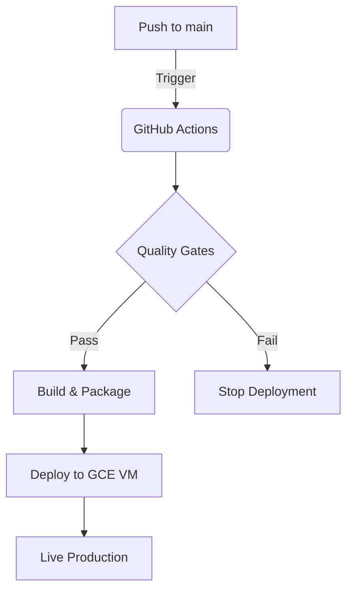

# CI/CD Pipeline - Main Branch

This document describes the automated deployment pipeline triggered when code is pushed to the `main` branch.

## Pipeline Architecture

## Workflow Steps (`.github/workflows/deploy.yml`)

### 1. Checkout & Environment Setup
*   **Action:** Clones the repository.
*   **Environment:** Sets up Python 3.12 and Node.js 20.

### 2. Quality Gates (Testing)
Before any deployment occurs, the code is tested to ensure stability.
*   **Backend Tests:**
    *   Installs dependencies (`requirements.txt` + `requirements-dev.txt`).
    *   Runs `pytest` to verify API endpoints, database logic, and reporting.

### 3. Build & Package (Artifacts)
*   **Action:** Zips the application source code into `project.zip`.
*   **Exclusions:** Removes local development artifacts (`node_modules`, `.venv`, `__pycache__`) to keep the upload light.

### 4. Deploy to Compute Engine (VM)
This step executes via SSH on your Google Cloud VM (`meal-voucher-server`).

1.  **Authentication:** Uses the `SSH_PRIVATE_KEY` secret to log into `34.27.147.116`.
2.  **File Transfer:** Copies the new `project.zip` to the server.
3.  **Remote Execution:**
    *   Unzips the project.
    *   Creates a `.env` file from GitHub Secrets (for sensitive config like `SMTP_PASSWORD`, `ADMIN_PIN`).
    *   Runs `docker-compose -f docker-compose.prod.yml up -d --build`.
        *   This rebuilds the containers.
        *   Passes `VITE_API_URL` to the frontend build process.
    *   Prunes unused Docker images to save disk space.

## Required GitHub Secrets

To ensure the pipeline works, the following secrets must be configured in your repository:

| Secret | Description |
| :--- | :--- |
| `GCP_SA_KEY` | (Optional) Service Account JSON key if using gcloud CLI. |
| `SSH_PRIVATE_KEY` | Private SSH key for accessing the VM. |
| `SSH_USERNAME` | Username associated with the SSH key (e.g., `github-actions`). |
| `VM_IP` | Public IP address of the VM (`34.27.147.116`). |
| `VITE_API_URL` | Public API URL for the frontend (e.g., `http://34.27.147.116:8000`). |
| `ADMIN_PIN` | Secure PIN for admin actions. |
| `SMTP_USER` | Email address for sending reports. |
| `SMTP_PASSWORD` | Password for the email account. |
| `SMTP_HOST` | SMTP server address. |
| `SMTP_PORT` | SMTP server port. |

## Key Files
*   `.github/workflows/deploy.yml`: The actual pipeline definition.
*   `docker-compose.prod.yml`: The production Docker configuration used on the VM.
*   `backend/Dockerfile` & `frontend/Dockerfile`: Build instructions for each service.
